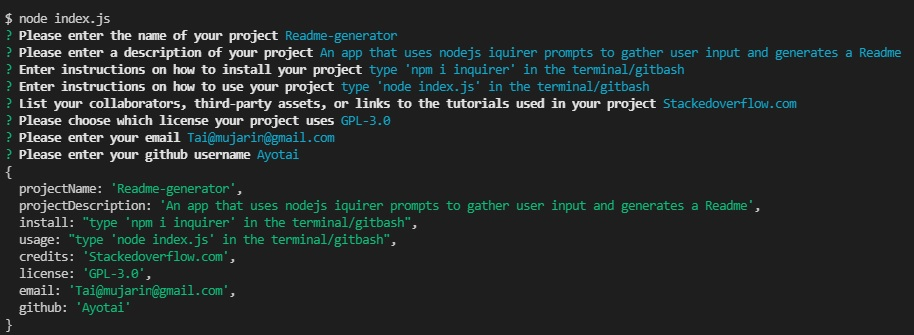

  # Readme-generator 
  ## Description 
  An app that uses nodejs inquirer prompts to gather user inputs and generates a README file for the user.

  ## Tables of Contents
  * [Installation](#installation)
  * [Usage](#usage)
  * [License](#license)
  * [Questions](#questions)
  
  ## Installation 
  * https://www.npmjs.com/package/inquirer
  * Git clone repository
  * Type 'npm i inquirer' in the terminal/gitbash
  
  ## Usage
  * Type 'node index.js' in the terminal/gitbash
  * Answer the prompt 
  * Then README.md will be generated in the files directory
  * Make neccessary changes
  * https://drive.google.com/file/d/1sswCtxMj990A1yHWxzDZfRK-zQlV1Fy7/view
  
  ## Credits
  Stackedoverflow.com
  
  ## Screenshot
  
  
  ## Questions
  For any questions please reach out to 
  github: [Ayotai](https://github.com/Ayotai)
  email: Tai@mujarin@gmail.com
  ## License 
  ### GPL-3.0
  
Permissions of this strong copyleft license are conditioned on making available complete source code of licensed works and modifications, which include larger works using a licensed work, under the same license. Copyright and license notices must be preserved. Contributors provide an express grant of patent rights.
